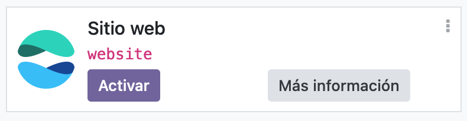
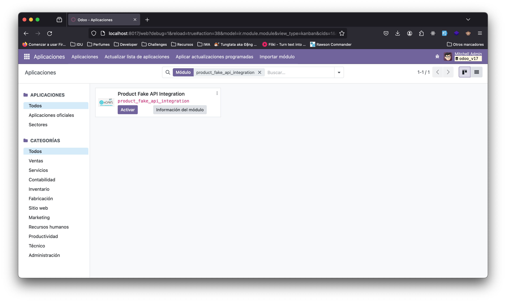
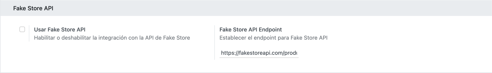
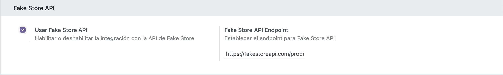
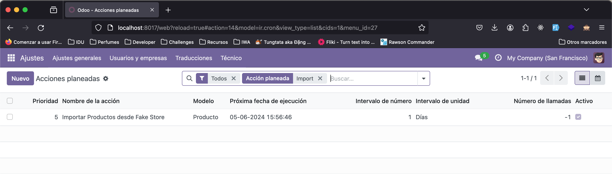
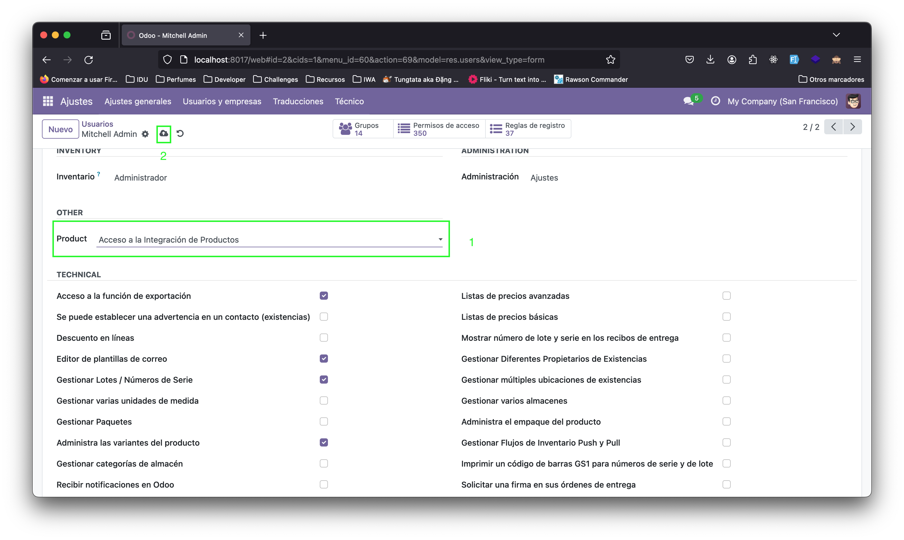
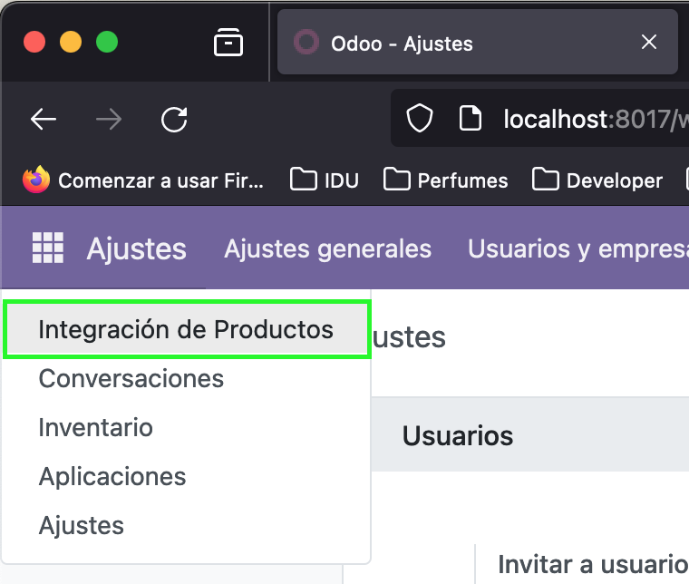
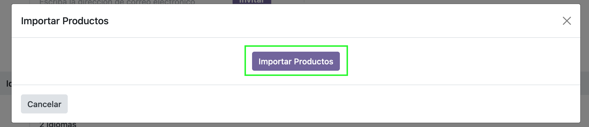
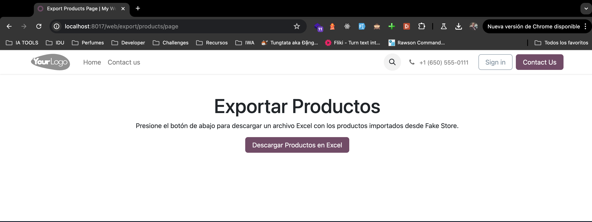

# Manual de instalación para el modulo "Product Fake API Integration"

### Modulos requeridos:

- Inventario (stock)
- Website (website)

### Instalando Modulo "Product Fake API Integration"

Vamos a:
**Home Menú => Aplicaciones**
Pegamos el nombre técnico del modulo a instalar en el buscador de aplicaciones y damos enter.

> product_fake_api_integration

Ahora, una vez identificado el modulo procedemos a instalarlo dando clic en Activar.
Una vez instalado se nos habilita en la sección de Ajustes Generales las opciones de Ajustes del modulo.

Por defecto el modulo se instala pero hay que habilitarlo, para ello se debe habilitar el check "Usar Fake Store API".

Una vez habilitado la sincronización con la API nos la hará cada 24Hrs (1 día), podemos verificar el tarea programada en el menú técnico.

> Importar Productos desde Fake Store

Podemos sincronizar los productos de forma inmediata con una opcion manual que tiene disponible, para ello vamos a darle permisos al usuario que va hacer la sincronización o importación de los productos.

Una vez habilitados los permisos estará disponible el menu

### Website para descargar archivo Excel con listado de productos

Ir a la siguiente url

> http://tudominio/web/export/products/page

Dar clic en el boton "Descargar Productos en Excel"

